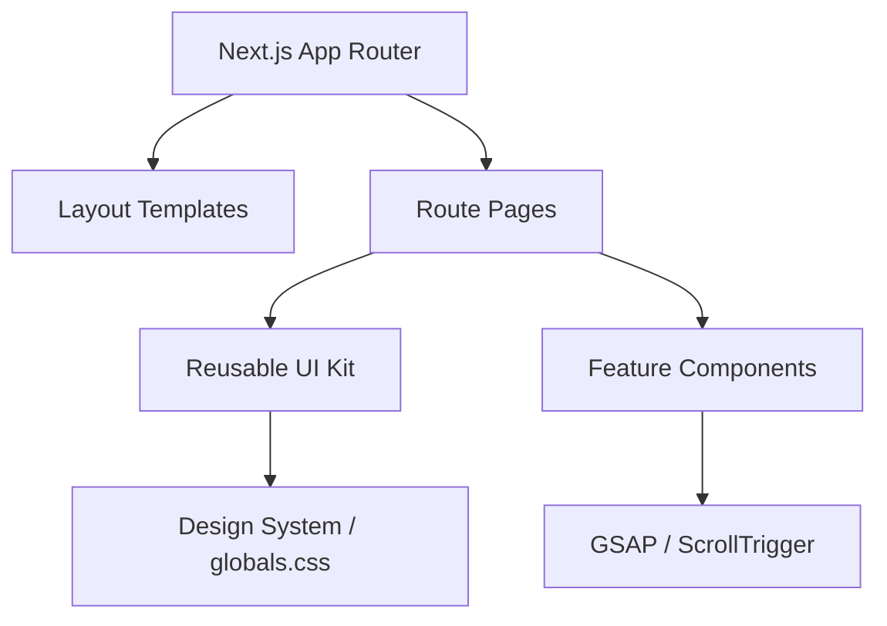

# Architecture

> Updated on 2026-04-17 following M1 Stability Sweep

## Overview
Binary Froster is a premium IT services platform built with Next.js 16 (App Router). It features high-fidelity motion graphics, interactive 3D-like UI components, and a comprehensive client portal. The application follows a "Design System First" approach, where visual tokens are centralized in CSS and consumed by a set of highly reusable React primitives.

## System Diagram

## Structure
- **[app/](file:///c:/Users/HP/OneDrive/Desktop/binary%20forster/src/app)**: Route handlers and page templates.
    - `layout.tsx`: Global wrapper with SEO, Navbar, and Footer.
    - `globals.css`: Central source of truth for design tokens.
- **[components/ui/](file:///c:/Users/HP/OneDrive/Desktop/binary%20forster/src/components/ui)**: The "Atomic" UI layer.
    - `GlassCard`: Standardized container with backdrop blur.
    - `TiltCard`: Mouse-tracking interactive card wrapper.
    - `LiquidButton`: Interactive CTA with ripple effects.
- **[components/layout/](file:///c:/Users/HP/OneDrive/Desktop/binary%20forster/src/components/layout)**: Structural scaffolding.
    - `PageLoader`: Intelligent loader with brand rendering and skip-if-visited logic.
    - `Navbar`: Responsive navigation with theme persistence.
- **[data/](file:///c:/Users/HP/OneDrive/Desktop/binary%20forster/src/data)**: Centralized data store.
    - `landing.ts`: Main copy and service data for the home page.

## Key Patterns
- **Animations**: Standardized on `@gsap/react`'s `useGSAP` hook for mount-safe timelines.
- **Loading State**: Global `PageLoader` uses `sessionStorage` to prevent repeating full brand animations within the same session.
- **Testing**: Vitest + Testing Library. Logic is validated via boundary-case suites; UI is validated via state-checking mocks.

## Conventions
- **Naming**: PascalCase for components, kebab-case for directories.
- **Styling**: Tailwind CSS v4; CSS Custom Properties for theme tokens.
- **Accessibility**: ARIA labels and `prefers-reduced-motion` support integrated into `ScrollReveal`.

## Updated Technical Debt
- [ ] **Build Validation**: Pending production build test for hydration check.
- [ ] **SEO Centralization**: Move SEO tags from individual layouts to a shared config.
- [ ] **Service Worker**: Potential PWA support for offline access to the Client Portal.
