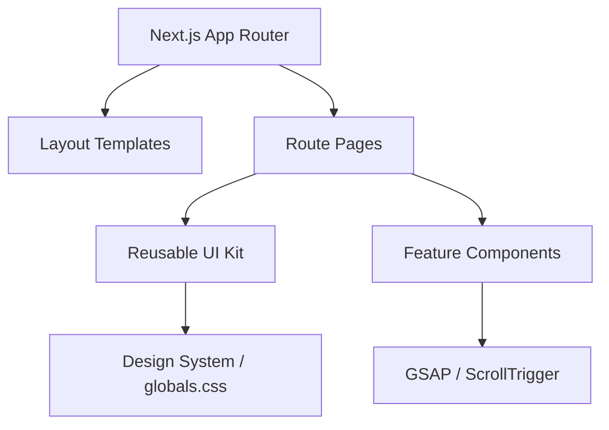

# Architecture

> Generated by /map on 2026-04-11

## Overview
Binary Froster is a premium IT services platform and SaaS landing site built with Next.js 16 (App Router). It features high-fidelity motion graphics, interactive 3D-like UI components, and a comprehensive client portal. The application follows a "Design System First" approach, where visual tokens are centralized in CSS and consumed by a set of highly reusable React primitives.

## System Diagram

## Structure
- **[app/](file:///c:/Users/HP/OneDrive/Desktop/binary%20forster/src/app)**: Route handlers and page templates.
    - `layout.tsx`: Global wrapper with SEO, Navbar, and Footer.
    - `globals.css`: Central source of truth for design tokens (colors, glass effects, animations).
    - `portal/`: Client-facing dashboard with complex state management (Kanban, Messaging).
- **[components/ui/](file:///c:/Users/HP/OneDrive/Desktop/binary%20forster/src/components/ui)**: The "Atomic" UI layer.
    - `GlassCard`: Standardized container with backdrop blur and border effects.
    - `TiltCard`: Mouse-tracking interactive card wrapper.
    - `LiquidButton`: Interactive CTA with loading states and ripple effects.
    - `ParticleCanvas`: Low-level WebGL/Canvas background engine.
- **[components/layout/](file:///c:/Users/HP/OneDrive/Desktop/binary%20forster/src/components/layout)**: Structural scaffolding (Nav, Footer, Loader).

## Data Flow
Currently, the application uses **Client-Side State** for interactive features:
- **Testimonials/Modals**: Local React state (`useState`).
- **Contact Form**: Local state with client-side validation logic.
- **Client Portal**: Mocked data structures handled by local state, ready for API integration.
- **Filtering**: Synchronous list processing in Service and Portfolio grids.

## Conventions
- **Naming**: PascalCase for components, kebab-case for directories.
- **Styling**: Tailwind CSS v4 for layout/spacing; CSS Custom Properties for theme tokens.
- **Interactions**: GSAP for timeline-based entrance and scroll-triggered animations.
- **Accessibility**: ARIA labels, `focus-visible` rings, and `prefers-reduced-motion` support are baked into core components.

## Technical Debt
- [ ] **Data Centralization**: Page-level data (Services list, Portfolio list) should be moved to a dedicated `data/` directory.
- [ ] **Hydration Warnings**: Some GSAP effects lack proper `useLayoutEffect` or cleanup, causing potential flickering in edge cases.
- [ ] **Hardcoded URLs**: Internal links are strings; should use a centralized route map.
- [ ] **Type Safety**: Some complex mock data structures in the Portal use `any` or loose types.
